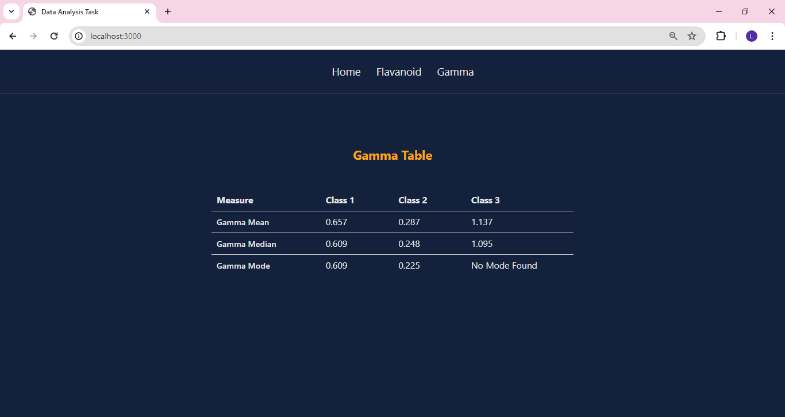

# Data Analysis

## Overview

- This project calculates statistical measures such as mean, median, and mode for the Wine Data Set using React with Mantine v7. The statistical measures are calculated for the "Flavanoids" property as well as a derived property "Gamma," and they are displayed in tabular format.

## ScreenShot




## Components

- `Flavanoid` : Component to retrieve flavanoid data from sample data set and display table.

- `Gamma` : Component to retrieve required data from sample data set and calculate gamma value.

- `TableComponent` : Reusable table component for displaying statistical measures.

## Utility Functions

- `Mean` : Utility function to calculate Mean for both flavanoid and gamma data.

- `Median` : Utility function to calculate Median for both flavanoid and gamma data.

- `Mode` : Utility function to calculate Mode for for both flavanoid and gamma data.

- `Wine-Data` : Sample Wine dataset used for calculations.

## Installations

- Clone the repository by running the below command

```
git clone git@github.com:Lavanya-Sathya/data-analysis-task.git
```

- Navigate to Project repository

```
cd data-analysis-task
```

- install dependencies using yarn

```
yarn install
```

## Running the Application

- Start the development server

```
yarn start
```

Runs the app in the development mode.\
Open [http://localhost:3000](http://localhost:3000) to view it in your browser.
